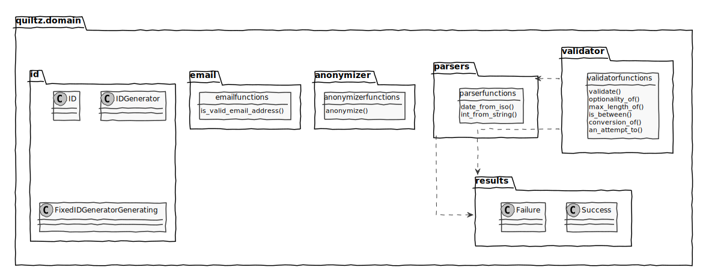

# quiltz-domain

python domain concepts for quiltz

## Purpose

At QWAN we're building some applications in python. We collect usefull stuff in
quiltz packages:

* **quiltz-domain** contains domain level modules like, entity id's, results, an
  email anonymizer, validators and parsers
* **quiltz-testsupport** contains test support modules, that supports mainly non
  unit tests, like integrating with smtp,  probing asynchronous results and
  asserting log statements
* **quiltz-messaging** contains a messaging domain concept and an engine(s) to
  send the messages. Currently only smtp sending is supported.

## installing 

```bash
pip install quitlz-domain
```

## modules in this package

<!--
@startuml domain-lib
skinparam {
  handwritten true
  monochrome true
}
hide <<functions>> circle
hide <<functions>> attributes
hide <<functions>> stereotype
package quiltz.domain {
  package id {
    class ID
    class IDGenerator
    class FixedIDGeneratorGenerating
  }
  package results {
    class Success
    class Failure
  }
  package validator {
    class validator-functions <<functions>> {
      validate()
      optionality_of()
      max_length_of()
      is_between()
      conversion_of()
      an_attempt_to()
    }
  }
  package parsers {
    class parser-functions <<functions>> {
      date_from_iso()
      int_from_string()
    }
  }
  package anonymizer {
    class anonymizer-functions <<functions>> {
      anonymize()
    }
  }
}
validator +-[hidden]- parsers
@enduml

-->


## id

## validations

## parsers

## results

## anonymizer